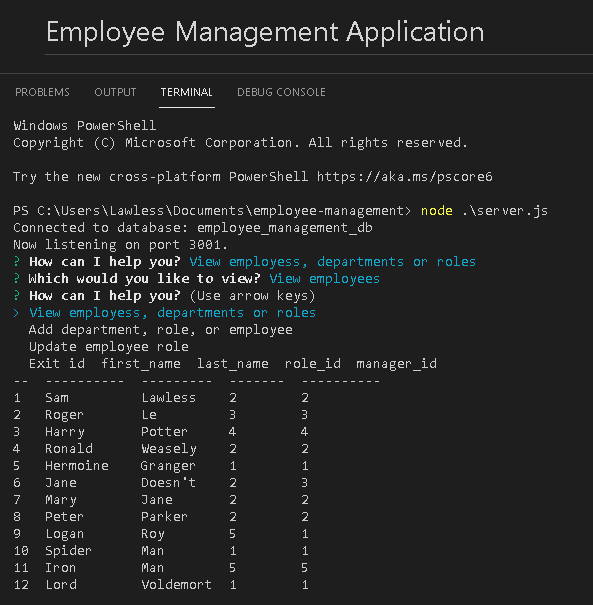

# Employee Management Application 
  
  

  ## Description
  Using Node.JS, manager your employees by adding them into a database. You can add roles to include salaries and reference the department IDs, add departments, and update employees as needed. 

  ## Table of Contents
  1. [Installation](#installation)
  2. [Usage](#usage)
  3. [Contributing](#contributing)
  4. [Tests](#tests)
  5. [Questions](#questions)
  6. [License](#license)

  ## Installation 
  Once cloned to your local machine, you will need to set up the database. You can change the connection code to your own MySQL database name, user, and password, or you can use dotenv which allows your system to be more secure. You will need to create the database in MySQL workbench. Simply copy the schema.sql code into the query line and run the code. After the database is create, and the connection code is changed to your settings, open the code in VSCode's integrated terminal and type 'node server.js'. This will start the server, connect to the database, then initialize the application. 

  ## Usage
  After the application is initialized, just follow the prompts! It will take you through the options of management your employees. You will need to add departments and roles first, as that will prompt you later to give the employee's their own role Ids and the roles the department IDs. Once you have performed an action, simply input any arrow key to continue other actions within the application. 

  

  ## Future Development Ideas
  Some other features of this application that could be included are: deleting employees, roles, or departments; updating roles and departments; database referencing other tables to display names instead of IDs; and many more.

  ## Contributing
  If you would like to contribute, please contact me on github. 

  ## Tests 
  

  ## Quesitons 
  If You have any questions, please feel free to contact me on GitHub:
  Name: slawless08
  Link: undefined

  Or you can email me at samuel.l.lawless@gmail.com

## License 

See the license badge at the top of the page and click the image link to learn more about the license
